# Deshal ERP — Entity Relationship Map

> **Document Version**: 1.0.0  
> **Scope**: Structural Mapping of All Business Entities, Foreign Key Relationships, and Dependencies.

---

## 1. Domain Relationship Map (Overview)

```mermaid
erDiagram
    COMPANIES ||--o{ BRANCHES : "has"
    COMPANIES ||--o{ PROFILES : "owns"
    COMPANIES ||--o{ CUSTOMERS : "manages"
    COMPANIES ||--o{ EMPLOYEES : "employs"
    COMPANIES ||--o{ SUPPLIERS : "purchases from"
    COMPANIES ||--o{ ACCOUNTS : "maintains GL"

    BRANCHES ||--o{ DEPARTMENTS : "contains"
    BRANCHES ||--o{ WAREHOUSES : "houses"
    BRANCHES ||--o{ SPACES : "operates"

    PROFILES ||--o{ USER_ROLES : "assigned"
    ROLES ||--o{ USER_ROLES : "granted to"
    ROLES ||--o{ ROLE_PERMISSIONS : "contains"
    PERMISSIONS ||--o{ ROLE_PERMISSIONS : "mapped"

    CUSTOMERS ||--o{ CONTACTS : "has"
    CUSTOMERS ||--o{ OPPORTUNITIES : "generates"
    CUSTOMERS ||--o{ LEASE_CONTRACTS : "signs"
    CUSTOMERS ||--o{ BOOKINGS : "reserves"
    CUSTOMERS ||--o{ INVOICES : "billed"

    EMPLOYEES ||--o{ ATTENDANCE_RECORDS : "logs"
    EMPLOYEES ||--o{ PAYROLL_SLIPS : "receives"
    EMPLOYEES ||--o{ REQUESTS : "submits"

    ACCOUNTS ||--o{ JOURNAL_ENTRY_LINES : "posts to"
    JOURNAL_ENTRIES ||--o{ JOURNAL_ENTRY_LINES : "contains"
    FISCAL_PERIODS ||--o{ JOURNAL_ENTRIES : "locks"
    COST_CENTERS ||--o{ JOURNAL_ENTRY_LINES : "allocated to"

    SUPPLIERS ||--o{ PURCHASE_ORDERS : "receives"
    PURCHASE_ORDERS ||--o{ PURCHASE_ITEMS : "contains"
    WAREHOUSES ||--o{ STOCK_TRANSACTIONS : "records"
    PRODUCTS ||--o{ STOCK_TRANSACTIONS : "tracked"
```

---

## 2. Structural Relationship Breakdown by Module

### 2.1 Core Organization & Identity Domain

#### `companies`
- **Primary Key**: `id UUID`
- **Relationships**:
  - `branches` (1:N via `company_id`)
  - `profiles` (1:N via `company_id`)
  - `customers` (1:N via `company_id`)
  - `accounts` (1:N via `company_id`)

#### `branches`
- **Primary Key**: `id UUID`
- **Foreign Keys**: `company_id -> companies(id)`
- **Relationships**:
  - `departments` (1:N via `branch_id`)
  - `employees` (1:N via `branch_id`)
  - `spaces` (1:N via `branch_id`)
  - `warehouses` (1:N via `branch_id`)

#### `profiles` (Linked to `auth.users`)
- **Primary Key**: `id UUID` (matches `auth.users.id`)
- **Foreign Keys**:
  - `company_id -> companies(id)`
  - `employee_id -> employees(id)` (optional)
- **Relationships**:
  - `user_roles` (1:N via `user_id`)

---

### 2.2 Customer & CRM Domain

#### `customers`
- **Primary Key**: `id UUID`
- **Foreign Keys**: `company_id -> companies(id)`
- **Relationships**:
  - `contacts` (1:N via `customer_id`)
  - `opportunities` (1:N via `customer_id`)
  - `lease_contracts` (1:N via `customer_id`)
  - `bookings` (1:N via `customer_id`)
  - `invoices` (1:N via `customer_id`)

#### `opportunities`
- **Primary Key**: `id UUID`
- **Foreign Keys**:
  - `company_id -> companies(id)`
  - `customer_id -> customers(id)`
  - `pipeline_stage_id -> pipeline_stages(id)`
  - `assigned_to -> profiles(id)`
- **Relationships**:
  - `activities` (1:N via `opportunity_id`)

---

### 2.3 Accounting & Financial Kernel

#### `accounts` (Chart of Accounts)
- **Primary Key**: `id UUID`
- **Foreign Keys**:
  - `company_id -> companies(id)`
  - `parent_id -> accounts(id)` (hierarchical self-reference)
- **Relationships**:
  - `journal_entry_lines` (1:N via `account_id`)

#### `journal_entries`
- **Primary Key**: `id UUID`
- **Foreign Keys**:
  - `company_id -> companies(id)`
  - `branch_id -> branches(id)`
  - `fiscal_period_id -> fiscal_periods(id)`
  - `posted_by -> profiles(id)`
- **Relationships**:
  - `journal_entry_lines` (1:N via `journal_entry_id`, cascade delete for draft)

#### `journal_entry_lines`
- **Primary Key**: `id UUID`
- **Foreign Keys**:
  - `journal_entry_id -> journal_entries(id)`
  - `account_id -> accounts(id)`
  - `cost_center_id -> cost_centers(id)`

---

### 2.4 HR, Attendance & Kiosk Domain

#### `employees`
- **Primary Key**: `id UUID`
- **Foreign Keys**:
  - `company_id -> companies(id)`
  - `branch_id -> branches(id)`
  - `department_id -> departments(id)`
- **Relationships**:
  - `employee_contracts` (1:N via `employee_id`)
  - `attendance_records` (1:N via `employee_id`)
  - `payroll_slips` (1:N via `employee_id`)
  - `requests` (1:N via `submitted_by_employee_id`)

#### `attendance_records` / `attendance_movement_logs`
- **Primary Key**: `id UUID`
- **Foreign Keys**:
  - `company_id -> companies(id)`
  - `employee_id -> employees(id)`
  - `kiosk_device_id -> kiosk_devices(id)`

---

### 2.5 Leasing, Spaces & POS Domain

#### `lease_contracts`
- **Primary Key**: `id UUID`
- **Foreign Keys**:
  - `company_id -> companies(id)`
  - `branch_id -> branches(id)`
  - `customer_id -> customers(id)`
  - `unit_id -> units(id)`
- **Relationships**:
  - `payment_installments` (1:N via `contract_id`)
  - `security_deposits` (1:N via `contract_id`)

#### `pos_orders`
- **Primary Key**: `id UUID`
- **Foreign Keys**:
  - `company_id -> companies(id)`
  - `branch_id -> branches(id)`
  - `cashier_shift_id -> cashier_shifts(id)`
  - `customer_id -> customers(id)`
  - `journal_entry_id -> journal_entries(id)`

---

## 3. Key Constraints & Referential Rules

1. **Delete Protection**:
   - `ON DELETE RESTRICT` on master lookups (`branches`, `accounts`, `customers`, `employees`) to prevent orphan records.
2. **Cascade Behavior**:
   - `ON DELETE CASCADE` for tightly coupled line items (`journal_entry_lines`, `invoice_lines`, `purchase_items`).
3. **Unique Keys**:
   - `(company_id, code)` on `accounts`, `products`, `employees`, `branches`.
   - `(company_id, entry_number)` on `journal_entries`.
   - `(company_id, invoice_number)` on `invoices`.
